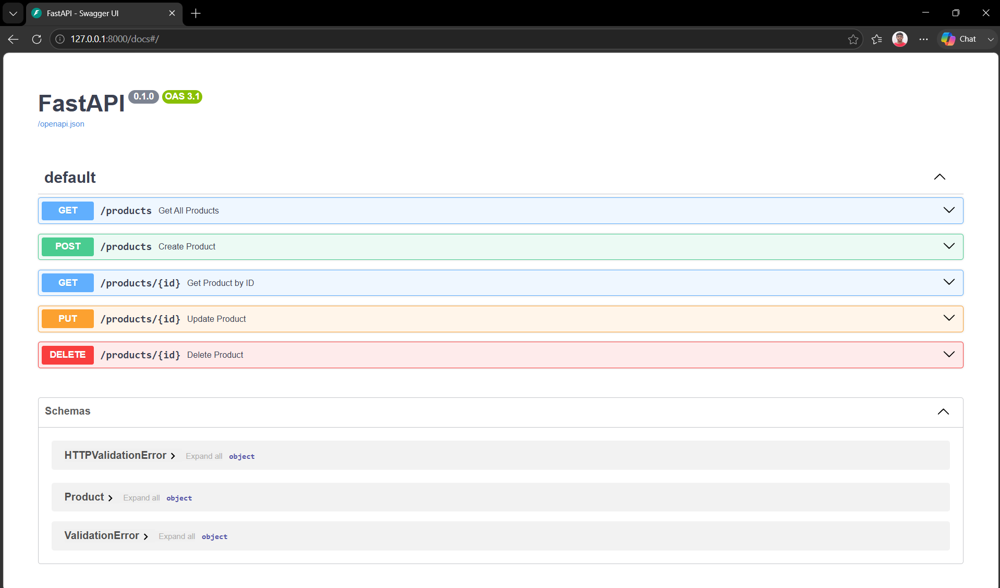
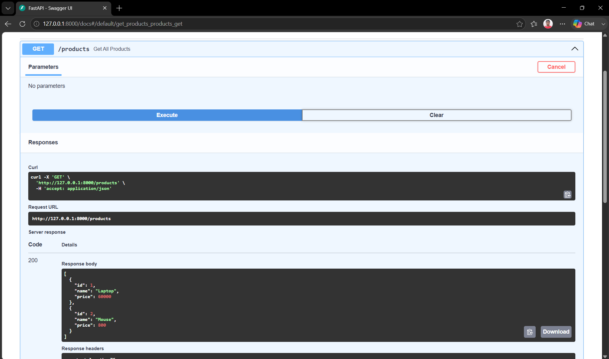

# Product CRUD API

A simple RESTful CRUD (Create, Read, Update, Delete) API built using **FastAPI**. This project demonstrates how to perform CRUD operations on products using an in-memory list without a database.

---


---

## 🛠️ Technologies Used

- Python 3
- FastAPI
- Uvicorn
- Pydantic

---

## 📁 Project Structure

```
Product-CRUD-API/
│── main.py
│── requirements.txt
│── README.md
│── .gitignore
└── screenshots/
    ├── swagger-home.png
    └── get-products-response.png
```

---

## 📦 Installation

Clone the repository:

```bash
git clone https://github.com/<your-username>/Product-CRUD-API.git
```

Navigate to the project folder:

```bash
cd Product-CRUD-API
```

Install dependencies:

```bash
pip install -r requirements.txt
```

---

## ▶️ Running the Application

Start the FastAPI server:

```bash
uvicorn main:app --reload
```

The application will run at:

```
http://127.0.0.1:8000
```

---

## 📚 Swagger Documentation

Interactive API documentation is available at:

```
http://127.0.0.1:8000/docs
```

---

## 📌 API Endpoints

| Method | Endpoint | Description |
| :----: | ---------------- | ----------------------- |
| GET | `/products` | Get all products |
| GET | `/products/{id}` | Get a product by ID |
| POST | `/products` | Create a new product |
| PUT | `/products/{id}` | Update an existing product |
| DELETE | `/products/{id}` | Delete a product |

---

## 📝 Sample Request

### Create Product

**POST** `/products`

```json
{
    "name": "Keyboard",
    "price": 1000
}
```

### Sample Response

```json
{
    "id": 3,
    "name": "Keyboard",
    "price": 1000
}
```

---

## 📸 Swagger UI Screenshots

### 1. Swagger UI Overview

The Swagger interface displaying all available CRUD endpoints.



---

### 2. GET /products Execution

Example of a successful API request returning all available products.



---

## 📌 Notes

- Products are stored in an **in-memory list**.
- No database is used.
- Restarting the server resets all stored data.
- This project is intended for learning FastAPI CRUD operations.

---

## 👨‍💻 Author

**Somil Jain**

Backend AI Engineering – Week 2 Assignment
